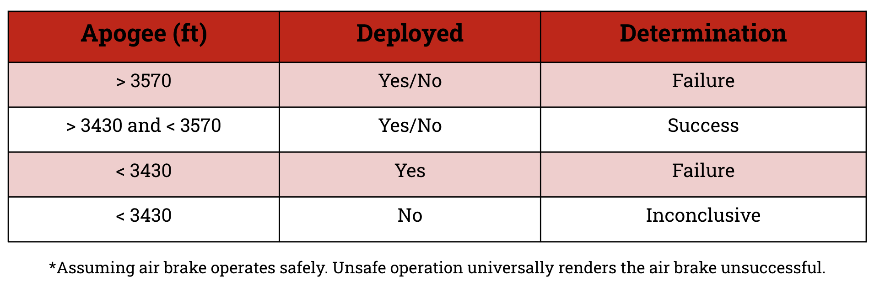

# 1. Overview

This software was designed to run on a Teensy 3.6 in support of the 2019-2020 Pitt SOAR variable drag system (VDS) airbrake for the full scale NASA USLI launch vehicle. The purpose of the airbrake is to control the launch vehicle's apogee to try to get the vehicle as close to its declared target apogee as possible.

It consists of a finite state machine driven by a deployment algorithm consisting of a number of parameters. 'Parameters’ are aspects of the model which can be independently modified to alter the performance of what is called the 'main algorithm', which is the program flow for the main function. 

Integer parameters are static values whereas sub-algorithms are pieces of functionality. The division of the main algorithm into sub-algorithm is to enable ease of testing and to identify independent functionality which can be reused elsewhere on the vehicle. Sub-algorithms which are more difficult to test feature simpler implementations to make testing and verification easier. 

The primary design goals of this software (aside from supporting the mission of the airbrake) are: 

1. __Fail safely.__ Under no circumstances should the airbrake's operation lead to the failure of a launch. This means all operations err on the side of doing nothing (e.g. the system never detects launch where the was no launch event, but it ight fail to detect a launch where there was a launch event).

2. __Make testing easy.__ Due to the aforementioned safety-critical nature of airbrake software, all software has been designed in discrete units that are easily testable. Interfaces were written with testing in mind.

3. __Promote code reuse.__ This is just one of several software projects for Pitt SOAR's 2019-2020 USLI vehicle, and several other software projects use similar functionality. Heavy emphasis was placed on reusing software from other projects and on making new software reusable elsewhere.

Beyond design goals, success is defined as the launch vehicle achieving within 70 feet of its target apogee, regardless of whether or not the airbrake blades ever deploy during flight. Shown below is a formalize definition of how success is defined for airbrake operation.

# 2. Sub-Algorithm Descriptions

## 2.1 SA-1: Determination of Launch Detection

TODO: Add description

## 2.2: SA-2 Determination of Motor Burnout

TODO: Add description

## 2.3: SA-3: Airbrake Deployment Incrementation Algorithm

TODO: Add description

## 2.4: SA-4: Apogee Prediction

TODO: Add description

## 2.5: SA-5: Determination of Descent Detection

TODO: Add description

# 3. Dev Environment Setup

All development used the PlatformIO extension for Visual Studio Code.

TODO: Add more info

# 4. Relevant Links

* [Original deployment algorithm documentation ](https://docs.google.com/document/d/1qq0nmyqW3g3wkucI6V3XiiaBdJnb-GQawClglQOAYOM/edit#)
* [Sub-algorithm test plan](https://docs.google.com/document/d/130fPIKDiWxRjwC1eHgn8vEJmvnMhvv1aIwvGFC2JZu0/edit)
* [Sub-algorithm test matrix](https://docs.google.com/spreadsheets/d/1-hUiYAFvpETWn4wtxwzF-okXmnx6dhZY2qigwSgHFRo/edit)